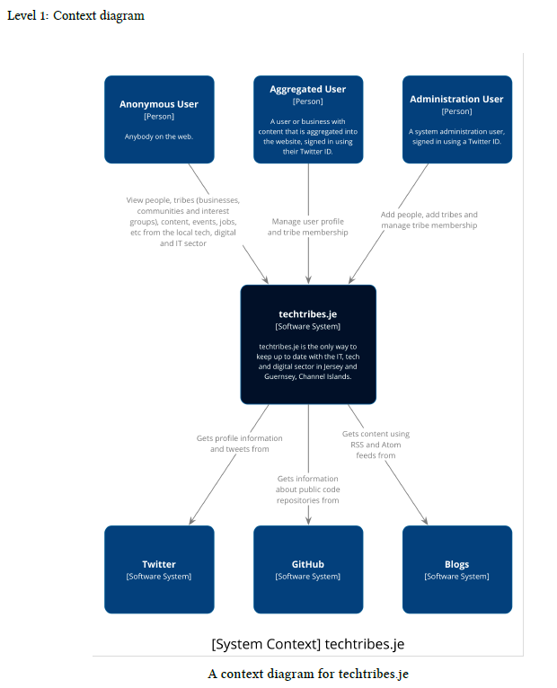
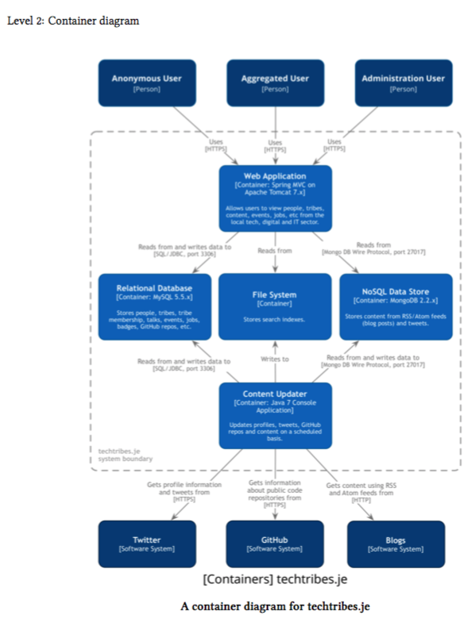
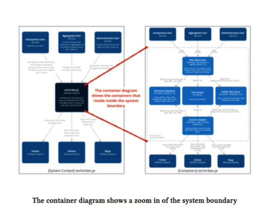
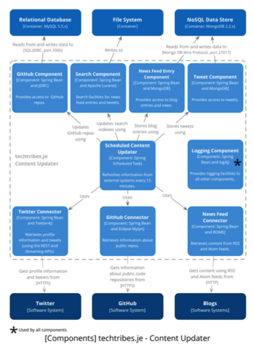
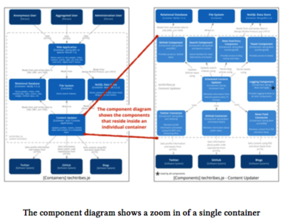
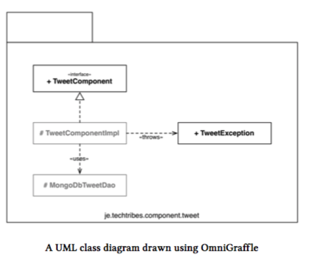
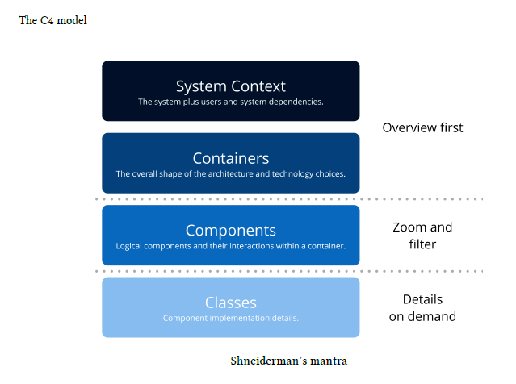

# C4 Model for architecture - Notes

_These are the notes taken as I was reading the book **Software Architecture for Developers** by Simon Brown. Please buy the book and read for full context and understanding [here](https://leanpub.com/visualising-software-architecture)_

Lightweight ideas and techniques that software development teams can use to visualize and document their software. This is about **effectively and efficiently** communicating the software architecture of the software that you are building.

- Architectural diagrams are the maps that help software developers navigate a complex codebase.

Table of Contents

<!-- TOC depthFrom:1 depthTo:6 withLinks:1 updateOnSave:1 orderedList:0 -->

 - [C4 Model for architecture - Notes](#c4-model-for-architecture-notes)

  - [Software Systems](#software-systems)
  - [Containers](#containers)
  - [Components](#components)
  - [Modules and subsystems](#modules-and-subsystems)
  - [THE C4 MODEL](#the-c4-model)

    - [Context](#context)

      - [Intent](#intent)
      - [Structure](#structure)
      - [Elements](#elements)

        - [People](#people)
        - [Software systems](#software-systems)

      - [Interactions](#interactions)

      - [Motivation](#motivation)

    - [Container](#container)

      - [Intent](#intent)
      - [Structure](#structure)
      - [Elements](#elements)

        - [Containers](#containers)
        - [Interactions](#interactions)
        - [Motivation](#motivation)

    - [Component](#component)

      - [Intent](#intent)
      - [Structure](#structure)
      - [Elements](#elements)

        - [Components](#components)

      - [Interactions](#interactions)

      - [Motivation](#motivation)

    - [Classes (or Code)](#classes-or-code)

      - [Intent](#intent)
      - [Structure](#structure)

  - [Shneiderman's mantra](#shneidermans-mantra)

    - [Overview first (context and container diagrams)](#overview-first-context-and-container-diagrams)
    - [Zoom and filter (component diagram)](#zoom-and-filter-component-diagram)
    - [Details on demand (Class diagrams)](#details-on-demand-class-diagrams)

  - [Software Guidebook](#software-guidebook)

    - [Context](#context)

      - [Structure](#structure)

    - [Functional Overview](#functional-overview)

      - [Structure](#structure)

    - [Quality Attributes](#quality-attributes)

      - [Structure](#structure)

    - [Constraints](#constraints)

      - [Structure](#structure)

    - [Principles](#principles)

      - [Structure](#structure)

    - [Software Architecture](#software-architecture)

      - [Structure](#structure)

    - [Code](#code)

      - [Structure](#structure)

    - [Data](#data)

      - [Structure](#structure)

    - [Infrastructure Architecture](#infrastructure-architecture)

      - [Structure](#structure)

    - [Deployment](#deployment)

      - [Structure](#structure)

    - [Operation and Support](#operation-and-support)

      - [Structure](#structure)

    - [Development environment](#development-environment)

      - [Structure](#structure)

    - [Decision Log](#decision-log)

      - [Structure](#structure)

<!-- /TOC -->

 ## Static structure

- Software System

  - Container

    - Component

      - Class

## Software Systems

The highest level of abstraction and represents something that delivers value to its users, whether they are human or not.

## Containers

Represents something that hosts code or data, like an application or a database. A container is something that needs to be running in order for the overall software system to work.

- Separately deployable

## Components

A grouping of related functionality encapsulated behind a well-defined interface, which runs inside a container.

## Modules and subsystems

A mudule refers to an implementation unit (e.g. a library or some other collection of programming elements) that may be comibned with other modules into a component, which itself is instantiated to create component instances at runtime.

## THE C4 MODEL

### Context

A high-level diagram that sets the scene, including key system dependencies and people

#### Intent

It should help answer the following questions:

1. What is the software system that we are building ?
2. Who is using it?
3. How does it fit in with the existing environment ?

#### Structure

- Simple block diagram showing your software system as a box in the centre
- surrounded by its users and other software systems that it interacts with
- focus should be on people and software systems rather than technologies, protocol and other low-level details.

#### Elements

Contains two types of elements: People and Software Systems.

##### People

People who use your software system - users, roles, actors, persona, individual people.

- Name: name of the person, user, role, actor or persona
- Description: A short description of the person, their role, responsibilities, etc.

##### Software systems

Other software systems that your software system interacts with.

- Name
- Description: short description of the software system, its responsibilities, etc.

#### Interactions

Try to annotate every interaction

#### Motivation

- makes the context and scope of the software system explicit so that there are no assumptions
- shows what is being added to an existing environment
- high level diagram that technical and non-tech ppl can uses as a starting point for discussions
- starting point for identifying who you potentially need to go and talk to as far as understanding inter-system interfaces is concerned

### Container

Shows the high-level technology choices, how responsibilities are distributed across them and how the containers communicate.

#### Intent

helps you answer the following questions:

1. What is the overall shape of the software system ?
2. What are the high level technology decisions ?
3. How are responsibilities distributed across the system ?
4. How do containers communicate with one another ?
5. As a developer, where do I need to write code in order to implement features ?

#### Structure

- Simple block diagram showing the high-level technical elements that your software system consists of.

#### Elements

A container diagram can include three types of elements: people, software systems, and containers

##### Containers

Represents an execution/runtime environment or data storage.

- Name
- Technology: Implementation technology
- Description: Short descriptive statement. Execution environments: list of the container's key responsibilities. Data Store: major entities, tables, files, etc that are being stored

##### Interactions

Typically, communication between containers is out-of-process (or inter-process). Its very useful to explicitly identify this and summarize how these interfaces will work.

- purpose of the interaction (e.g. reads/writes data from, sends reports to)
- communication mechanism (e.g. Web Services, REST API)
- communication style (e.g. synchronous, asynchronous, batched, two-phase commit)
- protocols and port numbers (e.g. HTTP, HTTPS, SOAP, SMTP)

##### Motivation

- it makes the high-level technology choices explicit
- it shows the relationships between containers and how those containers communicate

### Component

For each container, a component diagram lets you see the key logical components and their relationships

#### Intent

helps you answer the following questions:

1. What components is each container made up of ?
2. Do all components have a home (i.e. reside in a container) ?
3. It is clear how the software works at a high-level ?

#### Structure

Block diagrams that shows that it is made up of number of components.

#### Elements

Can include four types of elements: people, software systems, containers, and components.

##### Components

components are the coarse-grained building blocks of your software system that live inside of a container.

- Name:
- Technology: implementation technology for the component
- Description: usually a brief sentence describing the component's responsibilities

You can think about and identify components regardless of how the code is packaged and the architectural style in use. Your component diagram should reflect the architectural style in use - layered, hexagonal, or something else.

#### Interactions

Useful information to add the diagram includes:

- The purpose of the interaction (e.g. 'uses', 'persists data using', 'delegates to')
- Communication style (e.g. synchronous, asynchronous)

#### Motivation

- shows the high-level decomposition of a container into components, each with distinct responsibilities
- shows where there are relationships and dependencies between components
- provides a high-level summary of the implementation details, including any frameworks or libraries being used
- components shown on the diagram can be explicitly mapped to the code, you have a good way to really understand the structure of a codebase

### Classes (or Code)

Optional level of detail with high-level UML Class diagrams.

#### Intent

To illustrate the structure of the code and, in this case, how a component is implemented.

#### Structure

create a class diagram using UML.

## Shneiderman's mantra

Overview first, zoom and filter, then details-on-demand. (simple concept for understanding and visualizing large quantities of data) 

### Overview first (context and container diagrams)

- Draw a system contact diagram to help to understand the scope of the system, who is using it and what the key system dependencies are.
- Open up the system and draw a diagram showing the containers that make up the system. This shows the overall shape of the software system, how responsibilities have been distributed and the key technology choices that have been made.

### Zoom and filter (component diagram)

How each application has been decomposed into components, services, modules, layers, etc. along with brief note about key responsibilities and technology choices.

### Details on demand (Class diagrams)

Optionally progress deeper into the hierarchy to show the classes that make up a particular component.

## Software Guidebook

Describe what you can't get from the code. Do resist the temptation to go into too much technical details. The following headings describe what you might want to include in a software guidebook:

1. Context
2. Functional Overview
3. Quality Attributes
4. Constraints
5. Principles
6. Software Architecture
7. Code
8. Data
9. Infrastructure Architecture
10. Deployment
11. Operation and Support
12. Development Environment
13. Decision Log

### Context

Simply used to set the scene for the remainder of the document.

#### Structure

A page or two is sufficient and a context diagram is a great way to tell the story.

### Functional Overview

Summarize the major functions of the software.

#### Structure

Functional specifications - its often useful to summarize the business domain and the functionality provided by the system. You can use a UML use case diagram or a collection of simple wireframes showing the important parts of the user interface. Alternatively, you could use flow chart or UML activity diagram.

### Quality Attributes

Summarize the quality attributes / non-functional requirements.

#### Structure

Simply listing out each of the quality attributes is good. Examples:

- Performance (latency / throughput)
- Scalability (data / traffic volumes)
- Availability (uptime, downtime, scheduled maintenance, 24x7, 99.9%)
- Security (authentication, authorization, data confidentiality)
- Extensibility
- Flexibility
- Auditing
- Monitoring and management
- Reliability
- Failover / disaster recovery targets ( manual / automatic, how long)
- Business continuity
- Interoperability
- Legal, compliance and regulatory requirements ( data protection act )
- Internationalization (i18n) and localization (L19n)
- Accessibility
- Usability
- ...

Each quality attribute should be precise, leaving no interpretation to the reader.

### Constraints

#### Structure

Simply listing the known constraints and briefly summarizing them will work. Examples:

- Time, budget and resources
- Approved technology lists and technology constraints
- Target deployment platform
- Existing systems and integration standards
- Local standards (e.g. development, coding, etc.)
- Public standards (e.g. HTTP, SOAP, XML, XML Schema, WSDL, etc.)
- Standard protocols
- Standard message formats
- Size of the software development team
- Skill profile of the software development team
- Nature of the software being built (e.g. tactical or strategic)
- Political constraints
- Use of internal intellectual property
- ...

### Principles

Make it explicit which principles you are following. These could have been explicitly asked for by a stake holder or they could be principles that you want to adopt and follow.

#### Structure

Use an existing set of software development principles or list out the principle that you are following and accompany each with a short explanation or link to further information. Examples:

- Architectural layering strategy
- No business logic in views
- No database access in views
- Use of interfaces
- Always use an ORM
- Dependency injection
- Hollywood principle - don't call us, we'll call you
- High cohesion, low coupling
- Follow SOLID (Single responsibility principle, Open/closed principle, Liskov substition principle, Interface segregation principle, Dependency inversion principle)
- DRY (don't repeat yourself)
- Ensure all components are stateless (e.g. to ease scaling)
- Prefer a rich domain model
- Prefer an anaemic domain model
- Always prefer stored procedures
- Never use stored procedures
- Don't reinvent the wheel
- Common approaches for error handling, logging, etc.
- Buy rather than build
- ...

### Software Architecture

Conceptual view or logical view.

#### Structure

Use the container or component diagrams as the main focus. Sometimes UML sequence or collaboration diagrams showing component interactions can be a useful way to illustrate how the software satisfies the major use cases/user stores/etc.

### Code

Implementation view or development view

#### Structure

Keep it simple, with a short section for each element that you want to describe and include diagrams if they help the reader. e.g. A high level UML call and/or sequence diagram.

### Data

Data associated with a software system is usually not the primary point of focus yet it's arguably more important than the software itself, so often its useful to document something about it.

#### Structure

Short section for each element that you want to describe and include domain models or entity relationship diagrams if they help the reader.

### Infrastructure Architecture

Physical architecture, what hardware does this include across all tiers.

#### Structure

Usually an infrastructure / network diagram showing the various hardware / network components and how they fit together, with a short narrative to accompany the diagram.

### Deployment

Mapping between the software and the infrastructure. How and where is the software installed and configured.

#### Structure

1. Tables: simple textual tables that show the mapping between software containers and/or components with the infrastructure they will be deployed on.
2. Diagrams: UML or 'boxes and lines' style deployment diagrams, showing the mapping of containers to infrastructure.

In both cases, use color coding that designate the runtime status of software and infrastructure.

### Operation and Support

Describe how people will run, monitor and manage your software. Is it clear how the software provides the ability for operation/support teams to monitor and manage the system.

#### Structure

This section is usually fairly narrative in nature, with a heading for each related set of information. (e.g. monitoring, diagnostics, configuration, etc.)

### Development environment

Summarize how people new to your team install tools and setup a development environment in order to work on the software.

#### Structure

Type of things that you might want to include:

- Pre-requisite versions of softawre needed
- Links to software downloads
- Links to virtual machine images
- Environment variables, Windows registry settings, etc.
- Host name entries
- IDE configuration
- Build and test instructions
- Database population scripts
- Usernames, passwords, and certificates for connecting to development and test services
- Links to build servers
- ...

Its still worth including some brief information about how these solutions work, where to find the scripts and how to run them.

### Decision Log

A log of the decisions that have been made during the development of the software system. Why did you choose technology or framework X over Y and Z. How did you do this ? Were you forced into making a decision about X based upon corporate policy or enterprise architecture strategies.

#### Structure

Keep it simple, with a short paragraph or [architecture decision record](http://thinkrelevance.com/blog/2011/11/15/documenting-architecture-decisions) describing each decision that you want to record. Do refer to other resources such as proof of concepts, performance testing results or product evaluations if you have them.
